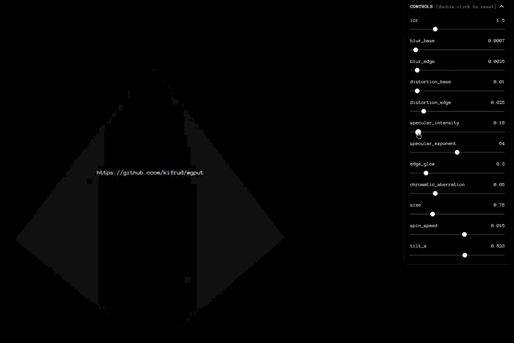

# Refractive Glass Pyramid — WebGPU Shader Playground

A real-time, physically-inspired glass-refraction shader built from scratch in raw **WebGPU + WGSL**. A rotating pyramid, rendered as frosted, chromatically-dispersive glass, sits in front of a dynamic text scene and refracts/blurs it live — with every optical parameter exposed through a control panel built on a tiny hand-rolled reactive state library (no UI framework, no state-management dependency).



## Features

- **Physically-inspired glass shading** in WGSL — Schlick Fresnel reflectance, per-channel (RGB) index-of-refraction for chromatic aberration, a 32-tap Vogel-spiral disk blur for frosted diffusion, Blinn–Phong specular, and rim/edge glow
- **Two-pass render pipeline** — a full-screen background pass (dynamic canvas-generated text texture) composited underneath a refractive glass mesh pass, sharing one depth buffer
- **Interactive text layer** — hovering a DOM link element re-renders the background texture, which is then visible (and refracted) *through* the glass
- **Live shader-tuning UI** — 12 uniform parameters (IOR, blur, distortion, specular, chromatic aberration, edge glow, size, spin speed, tilt) editable via sliders, generated declaratively from a config array
- **Custom reactive store** — a `Proxy`-based state container with computed values, automatic dependency tracking, memoized caching with cascade invalidation, and pub/sub — framework-free
- **Fully responsive** — GPU textures, depth buffer, and bind groups are rebuilt on resize; the projection matrix is recalculated
- **Graceful degradation** — explicit WebGPU support check with a fallback overlay for unsupported browsers

## How it works

### Render pipeline
Two pipelines run each frame, sharing one depth buffer:

1. **Background pass** — draws a full-screen triangle textured with a canvas-rendered text texture (`bg.wgsl`)
2. **Pyramid pass** — draws the pyramid mesh (a 4-sided pyramid: 4 triangular faces + a 2-triangle base, 18 vertices, back-face culled) using `pyramid.wgsl`, which samples the background texture through a refraction/blur pipeline per fragment

### The glass shader (`pyramid.wgsl`)
For every fragment:

- **Fresnel** — Schlick's approximation drives how much of the surface reflects (mixed toward white) versus transmits, based on view angle and IOR
- **Chromatic aberration** — the red, green, and blue channels each refract through a slightly different IOR (`ior ± chromatic_aberration`) and are sampled independently, producing subtle prism-like fringing at the edges
- **Vogel spiral blur** — 32 taps arranged in a golden-angle spiral approximate a soft disk blur, with radius increasing toward the silhouette, producing a frosted-glass look with no separate blur pass
- **Rim light / edge glow** — an edge-weighted term brightens the silhouette; a Blinn–Phong term adds a specular highlight from a fixed light direction

### Custom reactive store (`store.ts`)
Rather than pulling in a state-management library, the project implements its own minimal reactive system on top of a JS `Proxy`:

- `static` values are plain assignments
- `computed` values are functions whose dependencies are auto-discovered by tracking property reads through a nested `Proxy` the first time they run
- results are cached until a dependency changes, at which point a dependency graph (`deps` / `rdeps`) cascades invalidation to everything downstream
- a `$subscribe` API notifies listeners whenever any property (static or computed) changes, which the UI panel uses to keep labels and sliders in sync

### Control panel (`ui.ts` + `config.ts`)
Every tunable shader uniform is declared once, as data, in `paramConfigs` (name, min, max, step, default). `initControlsPanel` turns that config into sliders at runtime; double-clicking a control resets it to its default; and every change flows `slider → store → $subscribe → GPU uniform buffer`, re-written every frame in `main.ts`.

## Tech stack

- **WebGPU** for GPU rendering, **WGSL** for shaders
- **TypeScript**
- **gl-matrix** for camera and projection math
- **Vite** (`?raw` shader imports) — no UI framework, direct DOM APIs throughout

## Getting started

### Prerequisites
A WebGPU-enabled browser (Chrome/Edge 113+, or a Chromium-based browser with the `#enable-unsafe-webgpu` flag turned on).

```bash
pnpm install
pnpm dev
```

Build for production:

```bash
pnpm build
```

## Live controls

| Parameter | Range | Default | Effect |
|---|---|---|---|
| `ior` | 1.0 – 3.0 | 1.5 | Index of refraction |
| `blur_base` / `blur_edge` | 0–0.02 / 0–0.05 | 0.0007 / 0.0025 | Frosted blur amount, center vs. edge |
| `distortion_base` / `distortion_edge` | 0–0.2 | 0.01 / 0.025 | Refraction strength, center vs. edge |
| `specular_intensity` / `specular_exponent` | 0–3 / 1–128 | 0.8 / 64 | Highlight brightness / tightness |
| `edge_glow` | 0–2.0 | 0.3 | Rim-light intensity |
| `chromatic_aberration` | 0–0.2 | 0.05 | RGB refraction split |
| `size` | 0.1–3.0 | 0.75 | Pyramid scale |
| `spin_speed` | -0.1–0.1 | 0.015 | Rotation speed |
| `tilt_x` | -π–π | 0.523 | X-axis tilt |

## Project structure

```
src/
├── main.ts                 # WebGPU setup, render loop, resize handling
├── store.ts                 # Custom reactive Proxy-based store
├── ui.ts                     # DOM controls panel
├── config.ts                 # Declarative shader parameter definitions
├── shaders/
│   ├── pyramid.wgsl          # Glass refraction shader
│   └── bg.wgsl                # Background text-texture shader
└── utils/
    ├── genPyramidData.ts      # Pyramid geometry generation
    └── textRender.ts          # Canvas → GPU texture text rendering
```

## License
```
MIT License

Copyright (c) 2026 kifrud

Permission is hereby granted, free of charge, to any person obtaining a copy
of this software and associated documentation files (the "Software"), to deal
in the Software without restriction, including without limitation the rights
to use, copy, modify, merge, publish, distribute, sublicense, and/or sell
copies of the Software, and to permit persons to whom the Software is
furnished to do so, subject to the following conditions:

The above copyright notice and this permission notice shall be included in all
copies or substantial portions of the Software.

THE SOFTWARE IS PROVIDED "AS IS", WITHOUT WARRANTY OF ANY KIND, EXPRESS OR
IMPLIED, INCLUDING BUT NOT LIMITED TO THE WARRANTIES OF MERCHANTABILITY,
FITNESS FOR A PARTICULAR PURPOSE AND NONINFRINGEMENT. IN NO EVENT SHALL THE
AUTHORS OR COPYRIGHT HOLDERS BE LIABLE FOR ANY CLAIM, DAMAGES OR OTHER
LIABILITY, WHETHER IN AN ACTION OF CONTRACT, TORT OR OTHERWISE, ARISING FROM,
OUT OF OR IN CONNECTION WITH THE SOFTWARE OR THE USE OR OTHER DEALINGS IN THE
SOFTWARE.
```